## Overview
The core mechanisms include

- Honzon stablecoin protocol for minting the aUSD stablecoin backed by cross-chain collateral 
- Multi-collateral CDP system for borrowing aUSD against DOT, LDOT, ACA and other assets
- Staking derivative tokens LDOT and LCDOT for accessing staking liquidity
- Cross-chain swaps and bridges to external assets like BTC, ETH
- Decentralized exchange and AMM functionality 
- Liquid staking and DOT vault to issue LDOT staking derivatives

The key components covered in our analysis are the aUSD CDP mechanism, LDOT/LCDOT liquid staking, and the new Collator Pool design for decentralized collator nomination.

### System Architecture:
The core Acala liquidity system consists of several key pallets:
- Honzon: Handles CDP operations, aUSD minting/burning, liquidations
- LDOTStaking: Manages LDOT staking derivative minting and fee distribution
- Homa: New unified staking derivative mechanism for issuing xDOT (formerly LDOT)
- Incentives: Distributes staking and liquidity mining rewards to various pools
- Cdp Treasury: Holds system surplus, stability fees, and liquidation proceeds
- DEX: Constant product AMM for swapping tokens and providing liquidity
- Collator Selection: On-chain collator nomination pool and candidate management

The pallets interact closely to enable the CDP and staking derivative functionality. 

```mermaid
graph TD
  Honzon --> |Mint/Burn aUSD| Cdp-Treasury
  Honzon --> |Create/Close CDPs| Collateral-Tokens
  Collateral-Tokens --> |Deposit/Withdraw| Cdp-Treasury
  Cdp-Treasury --> |Stability Fees| Incentives
  LDOTStaking --> |Mint/Burn LDOT| DOT-Tokens
  Homa --> |Mint/Burn xDOT| DOT-Tokens
  Homa --> |Distribute Rewards| Incentives
  DEX --> |Trading Fees| Incentives
  Collator-Selection --> |Bond/Unbond| DOT-Tokens
```



### Code Quality and Style:
The Acala code follows Rust best practices and uses common FRAME/Substrate idioms. Some notable observations:
- Heavy use of Substrate's Config and Trait patterns for abstraction
- Common utilities like math, currency, and time are abstracted into separate crates
- Consistent use of `decl_module`, `decl_storage`, `decl_event` macros
- Mostly avoids `unsafe` code and uses well-audited libraries like `sp-runtime`

However, there are some areas for improvement:
- Inconsistent formatting in some places, such as extra blank lines or commented out code
- A few instances of overly complex or deeply nested logic that could be simplified
- Some modules are quite large and could benefit from being split into separate files
- Test coverage is decent but some modules have little to no unit testing

**Here are a few representative examples of the code style and abstractions used:**

```rust
// Simple Config trait used for currency-related constants
pub trait AUSDConfig {
  fn min_price_change() -> Ratio;
  fn max_liquidation_ratio() -> Ratio;
  fn liquidation_penalty() -> Rate;
  // ...
}

// Struct representing a CDP
#[derive(Clone, Eq, PartialEq, RuntimeDebug, Encode, Decode)]
pub struct CDP<AccountId, Balance> {
  pub collateral_type: CurrencyId,
  pub owner: AccountId,
  pub collateral: Balance,
  pub issue: Balance,
}

// Event emitted when a new CDP is created  
fn deposit_event() = default;
fn deposit_event_indexed(topics: Vec<T::Hash>) {
  Self::deposit_event(RawEvent::NewCDP(topics[0], topics[1], topics[2]));
}
```

The code makes heavy use of generic types, traits, and encoded structs to allow for flexibility in the specific currency and account types used.

### Some Potentials

1. Fully centralized control of LDOT rewards
   - LDOT allocations are determined centrally via the manage_liquidity_pools function
   - This allows a single root controller to favor certain pools or adjust parameters without much transparency
   - A more decentralized governance process or on-chain signaling could improve fairness and community participation
   - Pool management actions should use time locks and be announced publicly to avoid appearance of impropriety

### Economic Risks:
1. Oracle attacks and manipulation  
   - Many core functions like liquidations and LDOT collateralization rely on accurate price feeds
   - However, the xc-oracle and AMM price sources could be manipulated by flash loans or capital-heavy attacks
   - Consider using a multi-oracle approach with economic guarantees like Chainlink or UMA's optimistic oracle
   - Provide for price circuit breakers to reduce the damage that could be caused by a compromised oracle

2. Homa unbonding griefing
   - When users unbond their xDOT from the Homa vault, it starts a 28 day unbonding period
   - A well-funded attacker could try to trap user funds in unbonding by repeatedly unbonding and rebonding their own xDOT
   - This could trap a victim's funds in an unbonding state and prevent them from re-collateralizing liquidatable CDPs
   - Consider a dynamic unbonding period based on amount or a max number of "grief" unbonds per account in a set timeframe

3. Collator pool centralization
   - The new collator pool design allows anyone to delegate their LCDOT to a collator candidate and receive rewards
   - However, this could cause centralization if a few well-resourced collators are able to accumulate the majority of delegations
   - Over time this could lead to a semi-permissioned or oligopolic validator set, reducing system security
   - Consider mechanisms like nomination limits or dynamic fee adjustments to favor decentralization over pure profit-maximization

### Systemic Risks:  
1. Complexity and cross-chain attack surface
   - The Acala/Karura systems are quite complex, with multiple pallets interacting across chains
   - The additional bridging and cross-chain message passing adds further complexity and risk
   - An exploit or attack on one chain or component could have cascading effects and destabilize the entire system
   - Prioritize defensive programming, modularity, and appropriate isolation between components 
   - Perform extensive integration testing and have detailed monitoring/incident response plans

2. Liquidity-based liquidation spirals
   - In times of market stress, the AMMs and CDP liquidation bots may not have sufficient liquidity to gracefully process liquidations
   - Cascading liquidations and DEX liquidity depletion could lead to a negative feedback loop, rapidly dropping collateral prices
   - The aUSD stablecoin could break its peg in an extreme deleveraging scenario, threatening the entire Acala ecosystem
   - Secure more robust and elastic liquidation backstops, potentially via external liquidity providers or protocol-owned stability reserves

3. Dependency on Polkadot security and liveness
   - Acala is deeply integrated with and dependent on the Polkadot Relay Chain for its security and consensus
   - Bugs or exploits in the underlying Polkadot codebase could impact the correctness of Acala's execution, even if Acala itself is implemented securely
   - Ensure the Acala team stays closely engaged with the Polkadot core developers and participates actively in Kusama/Polkadot testnets
   - Have fallback plans for emergency operation (e.g. GRANDPA halting) in case of extended Polkadot unavailability

While the Acala code is well-structured and follows best practices, there are a number of potential vulnerabilities, edge cases, and centralization risks that warrant further investigation and mitigation. Many of these risks result from the interaction of multiple complex pallets and user roles.

The risk of economic attacks, oracle manipulation, and cascading liquidations also needs to be carefully modeled and stress-tested. Acala should prioritize progressive decentralization of privileged admin roles and explore approaches like time-delays or multi-sig to limit potential centralized abuse.

**Recommendations:**
- Reduce centralization risks by progressively decentralizing privileged roles and limiting privileges to specific scopes/timeframes
- Model economic attack scenarios like oracle manipulation, collateral pricing errors, and unbonding griefing and adjust parameters to minimize risks
- Perform extensive integration testing across all core pallets and user flows to identify edge cases and unexpected interactions
- Establish monitoring, alerting, and incident response plans for potential attacks or Polkadot-level issues 
- Engage with Polkadot core development and test Acala extensively on Kusama before deploying to mainnet with real value at stake
- Consider additional decentralization mechanisms for LDOT/LCDOT distribution and Collator Pool operations

Acala is a powerful and ambitious liquidity protocol with the potential to unlock significant DOT liquidity. However, the complexity of the system and reliance on external actors creates substantial risks that need to be carefully managed. 

With further refinement, progressive decentralization, and proactive risk management, Acala can evolve into a battle-tested pillar of the Polkadot DeFi ecosystem. Let me know if you have any other questions!


More in-depth analysis of potential security vulnerabilities and improvement points in the provided code:
*******************************8
1. Incentives module src/modules/incentives/src/lib.rs

a. The [`accumulate_incentives`](https://github.com/code-423n4/2024-03-acala/blob/9c71c05cf2d9f0a2603984c50f76fc8a315d4d65/src/modules/incentives/src/lib.rs#L381-L392) function iterates over all pools and calls [`transfer_rewards_and_update_records`](https://github.com/code-423n4/2024-03-acala/blob/9c71c05cf2d9f0a2603984c50f76fc8a315d4d65/src/modules/incentives/src/lib.rs#L389-L401) for each pool. If there are many pools, this could potentially lead to high gas consumption and potentially hit the block gas limit. Consider batching the reward accumulation process or optimizing it to reduce the number of iterations.

b. The `[transfer_rewards_and_update_records`](https://github.com/code-423n4/2024-03-acala/blob/9c71c05cf2d9f0a2603984c50f76fc8a315d4d65/src/modules/incentives/src/lib.rs#L389-L401) function uses [`map_err`](https://github.com/code-423n4/2024-03-acala/blob/9c71c05cf2d9f0a2603984c50f76fc8a315d4d65/src/modules/incentives/src/lib.rs#L389) to handle errors during the reward transfer and update process. However, it only logs the error and doesn't propagate it further. Consider handling errors more explicitly and deciding whether to revert the transaction or take alternative actions based on the error type.

c. The [`claim_rewards`](https://github.com/code-423n4/2024-03-acala/blob/9c71c05cf2d9f0a2603984c50f76fc8a315d4d65/src/modules/incentives/src/lib.rs#L557-L559) function calls [`do_claim_rewards`](https://github.com/code-423n4/2024-03-acala/blob/9c71c05cf2d9f0a2603984c50f76fc8a315d4d65/src/modules/incentives/src/lib.rs#L416), which iterates over all pending rewards for a user. If a user has a large number of pending rewards, this could potentially lead to high gas consumption. Consider implementing pagination or limiting the number of rewards that can be claimed in a single transaction.

d. The module relies on the[ `RewardsSource`](https://github.com/code-423n4/2024-03-acala/blob/9c71c05cf2d9f0a2603984c50f76fc8a315d4d65/src/modules/incentives/src/lib.rs#L81) account to fund the incentive rewards. Ensure that this account is properly secured and has sufficient funds to cover the expected incentive payouts. Implement proper access controls and monitoring for this account.

2. Rewards module (src/orml/rewards/src/lib.rs):

a. The [`add_share`](https://github.com/code-423n4/2024-03-acala/blob/9c71c05cf2d9f0a2603984c50f76fc8a315d4d65/src/orml/rewards/src/lib.rs#L143) and [`remove_share`](https://github.com/code-423n4/2024-03-acala/blob/9c71c05cf2d9f0a2603984c50f76fc8a315d4d65/src/orml/rewards/src/lib.rs#L191) functions update the reward records for each currency in the pool. If there are many reward currencies in a pool, this could potentially lead to high gas consumption. Consider optimizing the reward record updates to minimize the number of storage writes.

b. The[ `claim_one`](https://github.com/code-423n4/2024-03-acala/blob/9c71c05cf2d9f0a2603984c50f76fc8a315d4d65/src/orml/rewards/src/lib.rs#L364) function calculates the claimable reward amount using `U256` arithmetic operations. While `U256` helps prevent overflows, it's important to ensure that the arithmetic operations are performed correctly and don't result in unintended rounding or precision issues.

c. The [`remove_share`](https://github.com/code-423n4/2024-03-acala/blob/9c71c05cf2d9f0a2603984c50f76fc8a315d4d65/src/orml/rewards/src/lib.rs#L191) function calls [`claim_rewards`](https://github.com/code-423n4/2024-03-acala/blob/9c71c05cf2d9f0a2603984c50f76fc8a315d4d65/src/orml/rewards/src/lib.rs#L263) before updating the user's share balance. This ensures that the user's pending rewards are claimed before their share is reduced. However, this also means that the user's share balance is not updated atomically with the reward claim. Consider whether this behavior aligns with the intended design and if there are any potential race conditions or exploits that could arise from this non-atomic update.

3. Earning module (src/modules/earning/src/lib.rs):

a. The [`unbond`](https://github.com/code-423n4/2024-03-acala/blob/9c71c05cf2d9f0a2603984c50f76fc8a315d4d65/src/modules/earning/src/lib.rs#L158-L173) and [`unbond_instant`](https://github.com/code-423n4/2024-03-acala/blob/9c71c05cf2d9f0a2603984c50f76fc8a315d4d65/src/modules/earning/src/lib.rs#L180-L205) functions allow users to unbond their tokens. Ensure that the unbonding process is properly validated and that users cannot unbond more tokens than they have bonded. Implement proper checks to prevent any potential overflows or underflows in the unbonding calculations.

b. The [`withdraw_unbonded`](https://github.com/code-423n4/2024-03-acala/blob/9c71c05cf2d9f0a2603984c50f76fc8a315d4d65/src/modules/earning/src/lib.rs#L231-L235) function allows users to withdraw their unbonded tokens after the unbonding period has passed. Ensure that the unbonding period is enforced correctly and that users cannot withdraw their tokens before the specified period has elapsed. Consider implementing additional checks or time-locks to prevent premature withdrawals.

### Potential Vulnerabilities:
1. Inaccurate share calculation and inflation in add_share()  
   - Rewards module `add_share()` has complex share inflation logic
   - Uses `U256 mul/div` to calculate share inflation, but this could potentially be exploited to mint excess shares
   - Impact: Attacker could stake a large amount when total stake is low to gain disproportionate shares
   - Mitigation: Carefully audit share inflation math and consider using `checked_mul/checked_div`

2. Exploiting instant unbond deduction fee 
   - `unbond_instant()` lets users unbond by paying a fee defined by `InstantUnstakeFee`
   - But the fee is calculated as amount * fee_ratio (L98)
   - For large unbond amounts, this multiplication could overflow, resulting in a small actual fee paid
   - Mitigation: Use `checked_mul()` or `saturating_mul()` for fee calculation

3. Inconsistent reward deduction and rounding behavior
   - Incentives module applies the `ClaimRewardDeductionRates` when users claim rewards 
   - But the rounding behavior used (round up, saturating, etc) is not clearly specified
   - Attackers may be able to exploit rounding issues to gain excess rewards over time
   - Mitigation: Clearly specify and enforce consistent rounding behavior in deduction calculations

Centralization Risks:
1. Privileged UpdateOrigin can arbitrarily change pool incentives
   - `update_incentive_rewards()` allows UpdateOrigin to modify incentive rewards for any pool 
   - But there are no checks or limitations on what amounts can be set
   - Risk of centralized admin setting unfair reward weights or draining reward pool 

2. RewardsSource is a centralized reward funding account
   - All pool reward payouts come from the RewardsSource account
   - If compromised or admin misuse, pool rewards could be stolen or withheld
   - Consider a more decentralized funding mechanism or DAO oversight of RewardsSource

### Mechanism and Economic Risks:
1. Unbonding and rebonding grief attack
   - Users can repeatedly unbond and rebond their stake via `unbond()` and `rebond()`
   - Each unbond/rebond cycle resets the 28-day unbonding period, locking funds again
   - Malicious user could trap funds in long unbonding by grief attacking victim accounts
   - Mitigation: Limit frequency of rebonds, or don't fully reset unbonding period on rebond

2. Incentive reward front-running
   - Incentive rewards are updated by privileged admin via `update_incentive_rewards()`
   - Admin could potentially front-run their own incentive changes to stake right before an increase
   - Mitigation: Use time-delay or pre-commit mechanism for changing incentives

3. Manipulating DexShare to maximize rewards
   - Dex pool staking uses the DexShare abstraction for LP token staking
   - Savvy users may be able to time their DexShare staking to maximize their share of rewards
   - E.g. staking right before a favorable incentive change or when others have unstaked
   - Could reduce reward fairness for passive/unsophisticated stakers

Systemic Risks:
----------
1. Reliance on PolkadotJs and ecosystem libraries 
   - The Acala apps and staking UI rely heavily on common libraries like polkadot.js
   - Security issues in PolkadotJs or downstream libraries could impact Acala frontend
   - Maintain updated dependencies and consider additional security hardening/monitoring

2. Staking derivatives and systemic risk
   - The ACA/LDOT/LCDOT staking system allows recursive staking and derivatives
   - May amplify system risks by creating leveraged exposure to underlying ACA/DOT security
   - Carefully model impact of derivative staking on overall system health
   - Limit staking derivative recursion depth 

3. Oracle and price manipulation risk
   - Some staking rewards (e.g. Dex rewards) may rely on asset price oracles
   - Oracle attacks or price manipulation could impact reward accuracy
   - Use decentralized oracle networks with economic security guarantees
   - Provide for emergency oracle freeze/circuit-breaker to limit exploit impact

Architecture Overview:


Admin Flow


User Flow


Core Contract


Contract Analysis (with risk highlights):


the Acala protocol has a complex architecture with multiple interacting components including CDPs, liquid staking derivatives, an on-chain DEX, and a collator nomination pool. This complexity introduces several risks:

1. Admin privileges are highly centralized and could be abused to drain funds or manipulate markets. Progressive decentralization and limiting role scope are recommended. 

2. The interactions between aUSD, xDOT, and other bridged assets create systemic risk. A failure in one component like liquidations or price oracles could ripple across the system, breaking the aUSD peg and depleting liquidity. Extensive stress-testing and circuit breakers are advisable.

3. The reliance on AMM pricing and centralized price oracles opens attack vectors for price manipulation via flash loans or liquidity attacks. Acala should pursue more robust decentralized oracles and consider cross-chain liquidity backstops.

4. The collator nomination pool has the potential for stake centralization over time as the highest-yielding collators attract the most delegations. Nomination limits and governance safeguards may help preserve decentralization.

While Acala's architecture is well-structured and modular, the combination of staking derivatives, bridged assets, and cross-chain liquidity introduces substantial complexity and risk. Continued defensive engineering, decentralization of privileged roles, and proactive risk modeling will be essential to maturing Acala into a robust DeFi hub for Polkadot.

### Time spent:
6 hours