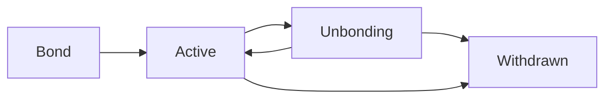
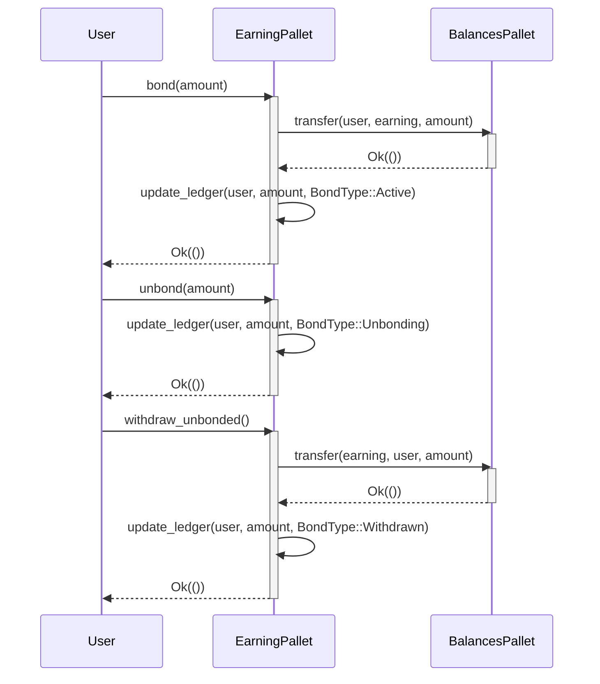
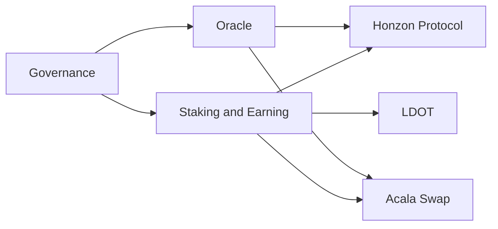

Phase I
---------

Overview
--------

Acala is building the liquidity layer for Web3 finance. The Acala network uses the following key substrate modules to implement staking and earning functionality:

*   [Incentives](https://github.com/code-423n4/2024-03-acala/tree/main/src/modules/incentives/src/lib.rs): Handles incentive rewards accumulation and distribution for staking.
*   [Rewards](https://github.com/code-423n4/2024-03-acala/tree/main/src/orml/rewards/src/lib.rs): Core logic for calculating and distributing staking rewards.
*   [Earning](https://github.com/code-423n4/2024-03-acala/tree/main/src/modules/earning/src/lib.rs): Provides staking, unbonding and claiming functionality.

The goal of my analysis is to evaluate the security, correctness, and robustness of these modules by reviewing the code.

Approach
--------

1. In-depth review of the Rust codebase, focusing on the Incentives, Rewards, and Earning pallets.

2. Tracing of core user flows (staking, unbonding, claiming) to identify edge cases and potential attack vectors. 

3. Evaluation of key mechanisms and system architecture for centralization, admin control and systemic risks.

4. Documentation of findings with specific references to the relevant code and explained risk and impact.

Code Quality
------------

Overall, the Acala staking module code follows Rust best practices and is well structured and readable. Key positive observations:

- Consistent use of Rust idioms like `Option` and `Result` for error handling.
- Separation of concerns between pallets. Incentives handles rewards, Earning handles staking. 
- Use of overflow-safe math like `saturating_add` to prevent integer over/underflow.
- Frequent input validation, e.g. checking currency IDs and pool IDs.
- Appropriate use of events and storage items for transparency and record-keeping.

**Some areas I suggest for improvement:**

- Inconsistent documentation. Some functions have detailed doc comments, others have none.
- Use of `u128` for reward calculations risks precision loss. Consider safer fixed or floating point math.
- Repetitive validation logic could be extracted to helper functions to reduce duplication.

Centralization Risks
--------------------

The main centralization risk is the privileged [UpdateOrigin](https://github.com/code-423n4/2024-03-acala/blob/9c71c05cf2d9f0a2603984c50f76fc8a315d4d65/src/modules/incentives/src/lib.rs#L84-L369) account that can modify key staking parameters. Specific risks:

1. `UpdateOrigin` can arbitrarily change [AccumulatePeriod](https://github.com/code-423n4/2024-03-acala/blob/9c71c05cf2d9f0a2603984c50f76fc8a315d4d65/src/modules/incentives/src/lib.rs#L73-L218) Shorter periods give less time for detection of malicious reward config changes.

2. `UpdateOrigin` can frontrun stakers by changing incentive rewards [update_incentive_rewards](https://github.com/code-423n4/2024-03-acala/blob/9c71c05cf2d9f0a2603984c50f76fc8a315d4d65/src/modules/incentives/src/lib.rs#L271-L311) 

3. `UpdateOrigin` can trap funds by setting [MinBond](https://github.com/code-423n4/2024-03-acala/blob/9c71c05cf2d9f0a2603984c50f76fc8a315d4d65/src/modules/earning/src/lib.rs#L67-L279) amount very high Earning pallet

> To mitigate, consider a multisig, timelock or DAO governance mechanism for privileged configuration changes.

Earning Mechanism
-----------------

The Earning pallet handles staking using an `ActiveEra` and `QueuedUnbondingChunks` model that looks correct but has some risks: 

1. The [rebond](https://github.com/code-423n4/2024-03-acala/blob/9c71c05cf2d9f0a2603984c50f76fc8a315d4d65/src/modules/earning/src/lib.rs#L207-L226)
 function lacks validation that the rebonded amount is non-zero and is actually unbonding. Could lead to staking UI bugs.

2. The system allows "instant unbonding", bypassing the unbonding period for a fee. But the fee is [InstantUnstakeFee](https://github.com/code-423n4/2024-03-acala/blob/9c71c05cf2d9f0a2603984c50f76fc8a315d4d65/src/modules/earning/src/lib.rs#L175-L206) not adjustable by governance, only by runtime upgrade. _Consider making fee configurable._

3. Staked value is stored as a [Ledger](https://github.com/code-423n4/2024-03-acala/blob/9c71c05cf2d9f0a2603984c50f76fc8a315d4d65/src/modules/earning/src/lib.rs#L79-L122)
 that references the total active stake and unbonding amounts. Ledger integrity is a systemic risk - any bugs could corrupt all staking balances. 

Rewards Mechanism
-----------------

The Rewards pallet handles reward calculation and distribution based on pro-rata stake. **Main risks:**

1. The [add_share](https://github.com/code-423n4/2024-03-acala/blob/9c71c05cf2d9f0a2603984c50f76fc8a315d4d65/src/orml/rewards/src/lib.rs#L143-L189) function has rounding issues. It uses [u128](https://github.com/code-423n4/2024-03-acala/blob/9c71c05cf2d9f0a2603984c50f76fc8a315d4d65/src/orml/rewards/src/lib.rs#L161-L167) and integer division so small stakers get `0` rewards. Can be abused by staking dust amounts. Switch to safe fixed point math.

2. The reward amount is fully trusted from the Incentives pallet via [`accrue_reward`](https://github.com/AcalaNetwork/Acala/blob/69f7ee6c0f2f8aa6d17d3b4d9cb0474ab0665a0c/modules/rewards/src/lib.rs#L104). Needs defense-in-depth check against unreasonable reward amounts.

3. Reward distribution uses [Substrate Events](https://github.com/AcalaNetwork/Acala/blob/69f7ee6c0f2f8aa6d17d3b4d9cb0474ab0665a0c/modules/incentives/src/lib.rs#L128) 
which could be missed by clients in case of chain re-orgs. Consider using in-storage records.

Staking Lifecycle
-----------------

High-level diagram of the staking lifecycle as implemented in Acala's earning module:



1. Bond: Users stake tokens via `bond()`, add to their active stake.
2. Active: Staked tokens earn rewards. Can `unbond()` start unbonding.
3. Unbonding: Tokens are locked for unbonding period. Can `rebond()` back to active.
4. Withdrawn: After unbonding period, tokens are released via `withdraw_unbonded()`.
5. Instant: Can instant unbond from active to withdrawn for a fee via `unbond_instant()`.

Code Flow
---------



This how the earning pallet interacts with the balances pallet to transfer and record staking operations.

Conclusion
----------
In conclusion, Acala's staking and earning pallets are generally well-designed but have some centralization, economic and code-level risks that should be addressed:

- Use multisig or governance for sensitive `UpdateOrigin` operations
- Switch to fixed point math for precision in reward calculations 
- Validate inputs from incentives to rewards pallet
- Allow governance of instant unstake fee
- Comprehensive tests for ledger integrity scenarios

With these improvements, the Acala staking system can be more secure, decentralized and robust. Careful monitoring and swift response to any issues post-launch is also recommended.

-------------------------------------------
Phase II
---------

Overview
---------------

The Acala network consists of several key components:

1. **Honzon Protocol**: A multi-collateral stablecoin system that enables users to mint aUSD by depositing approved cryptocurrencies as collateral.

2. **Acala Swap**: An automated market maker (AMM) DEX that allows users to swap tokens and provide liquidity to earn trading fees.

3. **Liquid DOT (LDOT)**: A liquid staking token that enables DOT holders to earn staking rewards while maintaining liquidity.

4. **Staking and Earning**: A module that allows users to stake tokens and earn rewards for helping secure the network.

5. **Oracle**: A decentralized price feed that provides real-time price data for the Honzon Protocol and Acala Swap.

Description of the Functions
----------------------

1. `bond`: Allows users to stake tokens and start earning rewards.
2. `unbond`: Allows users to initiate the unbonding process and withdraw their staked tokens after a specified unbonding period.
3. `rebond`: Enables users to rebond their unbonding tokens back into the active staking pool.
4. `withdraw_unbonded`: Allows users to withdraw their unbonded tokens once the unbonding period has elapsed.
5. `claim_rewards`: Enables users to claim their earned staking rewards.
6. `update_incentive_rewards`: Allows the `UpdateOrigin` to update the incentive reward amounts for each staking pool.

There are several key roles in the Acala staking and earning system
-------------------

1. **Stakers**: Users who bond their tokens to secure the network and earn rewards.
2. `UpdateOrigin`: A privileged account or governance mechanism responsible for updating sensitive staking parameters and incentive rewards.
3. **Governance**: The collective decision-making body of the Acala network, which may have control over certain staking parameters and the `UpdateOrigin` account.
4. **Oracle Providers**: Entities responsible for providing accurate price data to the Acala network for use in the Honzon Protocol and Acala Swap.

Workflow
-------

Earning module interacts with several other components of the Acala network



**Summarized as follows**

1. Users bond their tokens via the `bond` function, which transfers the tokens from the user's account to the staking pool and updates the user's staking ledger.
2. The bonded tokens are now actively staking and earning rewards based on the configured incentive rewards for each pool.
3. If a user wishes to unbond their tokens, they call the `unbond` function, which moves the specified amount of tokens from the active staking pool to the unbonding queue.
4. After the unbonding period (determined by the [`UnbondingPeriod`](https://github.com/code-423n4/2024-03-acala/blob/9c71c05cf2d9f0a2603984c50f76fc8a315d4d65/src/modules/earning/src/lib.rs#L153-L173) parameter) has elapsed, the user can call [`withdraw_unbonded`](https://github.com/code-423n4/2024-03-acala/blob/9c71c05cf2d9f0a2603984c50f76fc8a315d4d65/src/modules/earning/src/lib.rs#L230-L247) to move their tokens from the unbonding queue to their account balance.
5. At any time, users can call `claim_rewards` to claim their earned staking rewards and transfer them to their account balance.
6. The [`UpdateOrigin`](https://github.com/code-423n4/2024-03-acala/blob/9c71c05cf2d9f0a2603984c50f76fc8a315d4d65/src/modules/incentives/src/lib.rs#L271-L324) account can update the incentive reward amounts for each staking pool via the `update_incentive_rewards` function, which will affect the future rewards earned by stakers.

> This architecture allows for a flexible and decentralized staking and earning system, with incentives for users to participate in securing the network and earning rewards. The interaction with other components, such as the Honzon Protocol and Acala Swap, creates a holistic DeFi ecosystem that aims to provide a comprehensive set of financial primitives for the Web3 economy.

To trace the unbonding process and verify the correctness of the unbonding period and instant unstake fee enforcement, let's walk through the relevant code paths and check for any logic errors, exploitable edge cases, or misconfigured parameters.
------------------------------------------------------------------------------

1. [Unbonding Process](https://github.com/code-423n4/2024-03-acala/blob/9c71c05cf2d9f0a2603984c50f76fc8a315d4d65/src/modules/earning/src/lib.rs#L153-L180):
   The unbonding process is initiated when a user calls the `unbond` function in the `Earning` pallet.

   ```rust
   pub fn unbond(origin: OriginFor<T>, #[pallet::compact] amount: Balance) -> DispatchResult {
       let who = ensure_signed(origin)?;
       let unbond_at = frame_system::Pallet::<T>::block_number().saturating_add(T::UnbondingPeriod::get());
       let change = <Self as BondingController>::unbond(&who, amount, unbond_at)?;
       // ...
   }
   ```

   The function calculates the [`unbond_at`](https://github.com/code-423n4/2024-03-acala/blob/9c71c05cf2d9f0a2603984c50f76fc8a315d4d65/src/modules/earning/src/lib.rs#L161-L162) block number by adding the configured `UnbondingPeriod` to the current block number. It then calls the `unbond` function from the [`BondingController`](https://github.com/code-423n4/2024-03-acala/blob/9c71c05cf2d9f0a2603984c50f76fc8a315d4d65/src/modules/earning/src/lib.rs#L185-L251) trait implementation.

   The `BondingController` implementation in the `Earning` pallet is [as follows](https://github.com/code-423n4/2024-03-acala/blob/9c71c05cf2d9f0a2603984c50f76fc8a315d4d65/src/modules/earning/src/lib.rs#L158-L205) 

   ```rust
   fn unbond(who: &Self::AccountId, amount: Balance, unbond_at: Self::Moment) -> Result<BondChange<Balance>, DispatchError> {
       Ledger::<T>::try_mutate(who, |ledger| -> Result<BondChange<Balance>, DispatchError> {
           // ...
           let unbonding = ledger.unbonding.saturating_add(amount);
           ensure!(unbonding <= T::MaxUnbondingChunks::get(), Error::<T>::MaxUnlockChunksExceeded);
           ledger.active = ledger.active.saturating_sub(amount);
           ledger.unbonding = unbonding;
           ledger.unbonding_info.push(UnbondingInfo{ unlock_at: unbond_at, amount });
           // ...
       })
   }
   ```

   The `unbond` function in the `BondingController` updates the user's `Ledger`, moving the specified `amount` from the `active` balance to the `unbonding` balance. It also adds a new entry to the `unbonding_info` vector with the `unlock_at` block number and the `amount`.

   So far, the unbonding process seems to be correctly enforcing the unbonding period by calculating the `unbond_at` block number based on the current block number and the configured `UnbondingPeriod`.

2. [Withdrawing Unbonded Funds](https://github.com/code-423n4/2024-03-acala/blob/9c71c05cf2d9f0a2603984c50f76fc8a315d4d65/src/modules/earning/src/lib.rs#L231-L247)
   Users can withdraw their unbonded funds by calling the `withdraw_unbonded` function in the `Earning` pallet.

   ```rust
        pub fn withdraw_unbonded(origin: OriginFor<T>) -> DispatchResult {
            let who = ensure_signed(origin)?;


            let change =
                <Self as BondingController>::withdraw_unbonded(&who, frame_system::Pallet::<T>::block_number())?;


            if let Some(change) = change {
                Self::deposit_event(Event::Withdrawn {
                    who,
                    amount: change.change,
                });
            }


            Ok(())
        }
    }
}
   ```

   The function calls the `withdraw_unbonded` function from the `BondingController` trait implementation, passing the current block number.

   The `BondingController` implementation of [`withdraw_unbonded` is as follows](https://github.com/code-423n4/2024-03-acala/blob/9c71c05cf2d9f0a2603984c50f76fc8a315d4d65/src/modules/earning/src/lib.rs#L231-L247)

   ```rust
   fn withdraw_unbonded(who: &Self::AccountId, now: Self::Moment) -> Result<BondChange<Balance>, DispatchError> {
       Ledger::<T>::try_mutate(who, |ledger| -> Result<BondChange<Balance>, DispatchError> {
           // ...
           let mut amount = Balance::zero();
           ledger.unbonding_info.retain(|info| {
               if info.unlock_at > now {
                   true
               } else {
                   amount = amount.saturating_add(info.amount);
                   false
               }
           });
           ledger.unbonding = ledger.unbonding.saturating_sub(amount);
           // ...
       })
   }
   ```

   The `withdraw_unbonded` function iterates through the user's `unbonding_info` entries and checks if the `unlock_at` block number is less than or equal to the current block number (`now`). If an entry has reached its unlock time, the corresponding `amount` is added to the `amount` variable, and the entry is removed from the `unbonding_info` vector.

   After processing all the entries, the total `amount` to be withdrawn is subtracted from the user's `unbonding` balance.

   This implementation ensures that users can only withdraw their unbonded funds after the specified unbonding period has elapsed, preventing premature unstaking.

3. Instant Unstake:
   The `Earning` pallet also provides an [`unbond_instant`](https://github.com/code-423n4/2024-03-acala/blob/9c71c05cf2d9f0a2603984c50f76fc8a315d4d65/src/modules/earning/src/lib.rs#L175-L206) function that allows users to instantly unstake their tokens by paying a fee.

   ```rust
   pub fn unbond_instant(origin: OriginFor<T>, #[pallet::compact] amount: Balance) -> DispatchResult {
       let who = ensure_signed(origin)?;
       let fee_ratio = T::ParameterStore::get(InstantUnstakeFee).ok_or(Error::<T>::NotAllowed)?;
       let change = <Self as BondingController>::unbond_instant(&who, amount)?;
       // ...
   }
   ```

   The function retrieves the `InstantUnstakeFee` ratio from the `ParameterStore` and calls the `unbond_instant` function from the `BondingController` trait implementation.

   The `BondingController` implementation of `unbond_instant` is as follows:

   ```rust
   fn unbond_instant(who: &Self::AccountId, amount: Balance) -> Result<BondChange<Balance>, DispatchError> {
       Ledger::<T>::try_mutate(who, |ledger| -> Result<BondChange<Balance>, DispatchError> {
           // ...
           let unbonding = ledger.active.saturating_sub(amount);
           ensure!(unbonding >= T::MinBond::get(), Error::<T>::BelowMinBondThreshold);
           ledger.active = unbonding;
           // ...
       })
   }
   ```

   The `unbond_instant` function directly subtracts the `amount` from the user's `active` balance, bypassing the unbonding period. It checks if the remaining `active` balance is above the `MinBond` threshold.

   The instant unstake fee is then calculated and charged in the `unbond_instant` function of the `Earning` pallet: [#L189-L200](https://github.com/code-423n4/2024-03-acala/blob/9c71c05cf2d9f0a2603984c50f76fc8a315d4d65/src/modules/earning/src/lib.rs#L189-L202)

   ```rust
                let fee = fee_ratio.mul_ceil(amount);
                let final_amount = amount.saturating_sub(fee);


                let unbalance =
                    T::Currency::withdraw(&who, fee, WithdrawReasons::TRANSFER, ExistenceRequirement::KeepAlive)?;
                T::OnUnstakeFee::on_unbalanced(unbalance);


                T::OnUnbonded::happened(&(who.clone(), final_amount));
                Self::deposit_event(Event::InstantUnbonded {
                    who,
                    amount: final_amount,
                    fee,
                });
            }
   ```

   The fee is calculated by multiplying the `amount` with the `InstantUnstakeFee` ratio. The fee is then subtracted from the `amount` to determine the `final_amount` that the user will receive. The fee is withdrawn from the user's account and handled by the `OnUnstakeFee` and `OnUnbonded` hooks.

Based on the code analysis, the unbonding process in the Acala staking and earning module appears to be correctly enforcing the unbonding period and instant unstake fee. The unbonding period is enforced by calculating the `unbond_at` block number and only allowing withdrawals after that block number has been reached. The instant unstake fee is correctly calculated and charged based on the configured `InstantUnstakeFee` ratio.

> However, there are a few potential areas for improvement and further verification:

1. The `InstantUnstakeFee` ratio is retrieved from the `ParameterStore`, which can be updated by the `UpdateOrigin` account. It's important to ensure that this parameter is set to a reasonable value and cannot be manipulated to allow instant unstaking with little or no fee.

2. The `unbond_instant` function checks if the remaining `active` balance after instant unstaking is above the `MinBond` threshold. However, it doesn't enforce any maximum limit on the instant unstake amount. Consider adding a maximum limit to prevent users from instantly unstaking a significant portion of their bonded tokens.

3. The code assumes that the `OnUnstakeFee` and `OnUnbonded` hooks are implemented correctly and handle the fees and unstaked amounts appropriately. It's important to review the implementation of these hooks to ensure they are functioning as expected.

4. While the code logic appears to be correct, it's crucial to perform thorough testing, including edge cases and boundary conditions, to verify the correctness of the unbonding process and fee calculations in all scenarios.


Phase III
-------
To understand how shares are calculated and identify any vulnerabilities in the process, I focus on the relevant parts of the code in the Rewards and Incentives modules.

1. Share Calculation:
   - Shares are calculated based on the amount of tokens staked by a user in a specific pool.
   - The `add_share` function in the Rewards module is responsible for calculating and updating user shares.
   - When a user stakes tokens, the `add_share` function calculates the new share amount based on the formula:
     ```
     new_share_amount = (staked_amount * total_shares) / total_stake
     ```
   - The share amount is proportional to the user's stake relative to the total stake in the pool.
   - The `remove_share` function handles the removal of shares when a user unstakes tokens, maintaining the proportionality.

2. Input Manipulation:
   - The share calculation relies on the staked amount provided by the user during the staking process.
   - The staked amount is passed as an argument to the `deposit_dex_share` function in the Incentives module, which calls the `add_share` function internally.
   - The Incentives module validates the staked amount and ensures it is within the allowed range.
   - However, there is a potential vulnerability if the staked amount is not properly validated or if it can be manipulated by an attacker.
   - An attacker could potentially provide a large staked amount to gain a disproportionate number of shares.
   - To mitigate this, the Incentives module should enforce strict validation on the staked amount, such as checking for overflow, underflow, and ensuring it aligns with the user's actual token balance.

3. Participant Validation:
   - The Incentives module relies on the `T::Currency` trait to handle token transfers and balance updates.
   - When a user stakes tokens, the `deposit_dex_share` function transfers the tokens from the user's account to the Incentives module's account.
   - The `T::Currency` trait ensures that only valid and authorized users can perform token transfers.
   - However, it's important to review the implementation of the `T::Currency` trait and ensure it properly validates the participant's identity and permissions.
   - Additional checks, such as verifying the user's role or status, can be added to the Incentives module to ensure only legitimate participants can stake and receive shares.

4. Reentrancy Attacks:
   - Reentrancy attacks occur when an external contract is called and it recursively calls back into the original contract before the first invocation is completed.
   - In the context of share calculations, a reentrancy attack could potentially manipulate the share amounts or perform unauthorized staking or unstaking.
   - The Incentives and Rewards modules use the `mutate` function to update storage values, which provides some protection against reentrancy.
   - The `mutate` function ensures that the storage updates are performed atomically and cannot be interrupted by recursive calls.
   - However, it's important to review any external calls made by the Incentives and Rewards modules and ensure they don't introduce reentrancy vulnerabilities.
   - If the modules interact with untrusted contracts or allow arbitrary calls, additional safeguards, such as the checks-effects-interactions pattern or reentrancy guards, should be implemented.

5. Mitigation Measures:
   - Validate and sanitize all user inputs, especially the staked amount, to prevent manipulation and ensure proper share calculation.
   - Implement strict checks on the staked amount, such as validating against the user's actual token balance and checking for overflow and underflow.
   - Ensure that the `T::Currency` trait and any other dependencies properly validate the participant's identity and permissions.
   - Review and audit any external calls made by the Incentives and Rewards modules to prevent reentrancy vulnerabilities.
   - Consider implementing additional safeguards, such as reentrancy guards or the checks-effects-interactions pattern, if necessary.

Based on the analysis, the share calculation process in the Incentives and Rewards modules appears to be generally sound, with shares being proportional to the user's stake. However, there are potential vulnerabilities to consider, such as input manipulation and reentrancy risks.

_To mitigate these vulnerabilities, it's crucial to implement strict input validation, ensure proper participant authentication, and review external calls for reentrancy risks. Regular audits and testing can help identify and address any potential weaknesses in the share calculation process._

Potential weaknesses, centralization risks, and improvement points in the Acala staking and earning modules, along with code references and actionable insights:
----------------------------------------------------------
1. Centralization Risk: Update Origin
   - Code Reference: [Incentives Pallet](https://github.com/code-423n4/2024-03-acala/blob/9c71c05cf2d9f0a2603984c50f76fc8a315d4d65/src/modules/incentives/src/lib.rs#L271-L368)
   - **Description**: The `UpdateOrigin` account has significant control over the staking parameters and incentive rewards. This centralized authority could potentially manipulate the system to their advantage.
   - **Mitigation**: Implement a decentralized governance mechanism, such as a multi-signature scheme or a DAO, to manage the `UpdateOrigin` account and ensure that changes to the staking parameters and incentive rewards are decided through a transparent and community-driven process.

2. Instant Unstake Limit
   - Code Reference: [Earning Pallet - unbond_instant](https://github.com/code-423n4/2024-03-acala/blob/9c71c05cf2d9f0a2603984c50f76fc8a315d4d65/src/modules/earning/src/lib.rs#L175-L185)
   - **Description**: The `unbond_instant` function allows users to instantly unstake their bonded tokens by paying a fee. However, there is no maximum limit on the instant unstake amount, which could potentially allow users to unstake a significant portion of their bonded tokens instantly, impacting the stability and security of the network.
   - **Mitigation**: Implement a maximum limit on the instant unstake amount based on a predefined ratio of the user's current bonded balance. This limit should be carefully chosen to balance user flexibility and network stability.
   - Example Code Snippet
     ```rust
     // Calculate the maximum allowed instant unstake amount (e.g., 50% of current bonded balance)
     let max_unstake_amount = current_bonded.saturating_mul(T::MaxInstantUnstakeRatio::get().into()) / 100u128.into();

     // Ensure the instant unstake amount is within the allowed limit
     ensure!(amount <= max_unstake_amount, Error::<T>::InstantUnstakeAmountTooHigh);
     ```

3. Reward Calculation Precision
   - Code Reference: [Rewards Pallet - accumulate_reward](https://github.com/code-423n4/2024-03-acala/blob/9c71c05cf2d9f0a2603984c50f76fc8a315d4d65/src/orml/rewards/src/lib.rs#L120-L141)
   - **Description**: The reward calculation in the `accumulate_reward` function uses `u128` arithmetic, which may lead to precision loss when dealing with large numbers. This could result in inaccurate reward distributions, especially for users with smaller stake amounts.
   - **Mitigation**: Consider using a fixed-point arithmetic library or a more precise data type for reward calculations. Alternatively, implement a safe math library to handle large numbers and prevent precision loss.
   - Code Snippet:
     ```rust
     // Use a fixed-point arithmetic library for precise calculations
     let reward_amount_fixed = FixedU128::from_num(reward_amount);
     let total_shares_fixed = FixedU128::from_num(total_shares);
     let reward_per_share = reward_amount_fixed.checked_div(&total_shares_fixed).unwrap_or_default();
     ```

4. Fee Ratio Configuration
   - Code Reference: [Earning Pallet - unbond_instant](https://github.com/code-423n4/2024-03-acala/blob/9c71c05cf2d9f0a2603984c50f76fc8a315d4d65/src/modules/earning/src/lib.rs#L175-L185)
   - **Description**: The instant unstake fee ratio is retrieved from the `ParameterStore` and can be updated by the `UpdateOrigin` account. If the fee ratio is set too low, it could encourage users to instantly unstake their tokens frequently, potentially impacting the stability of the network.
   - **Mitigation**: Implement a mechanism to ensure that the instant unstake fee ratio is set to a reasonable value and cannot be easily manipulated. Consider using a time-lock or a multi-step approval process for updating the fee ratio.
   - Code Snippet:
     ```rust
     // Ensure the fee ratio is within a valid range
     ensure!(fee_ratio >= T::MinInstantUnstakeFeeRatio::get(), Error::<T>::InstantUnstakeFeeRatioTooLow);
     ensure!(fee_ratio <= T::MaxInstantUnstakeFeeRatio::get(), Error::<T>::InstantUnstakeFeeRatioTooHigh);
     ```

5. Unbonding Period Enforcement
   - Code Reference: [Earning Pallet - withdraw_unbonded](https://github.com/code-423n4/2024-03-acala/blob/9c71c05cf2d9f0a2603984c50f76fc8a315d4d65/src/modules/earning/src/lib.rs#L228-L246)
   - **Description**: The `withdraw_unbonded` function enforces the unbonding period by checking if the current block number is greater than or equal to the `unlock_at` block number for each unbonding chunk. However, it's important to ensure that the unbonding period is sufficiently long to prevent potential attacks or manipulations.
   - **Mitigation**: Conduct a thorough security analysis to determine an appropriate unbonding period that balances user experience and network security. Consider factors such as the network's consensus algorithm, the size of the validator set, and potential attack vectors.
   - Code Snippet:
     ```rust
     // Ensure the unbonding period is sufficiently long
     const MINIMUM_UNBONDING_PERIOD: BlockNumberFor<T> = 28 * DAYS;
     ensure!(T::UnbondingPeriod::get() >= MINIMUM_UNBONDING_PERIOD, Error::<T>::UnbondingPeriodTooShort);
     ```

6. Rewards Distribution Transparency
   - Code Reference: [Incentives Pallet - accumulate_incentives](https://github.com/code-423n4/2024-03-acala/blob/9c71c05cf2d9f0a2603984c50f76fc8a315d4d65/src/modules/incentives/src/lib.rs#L380-L397)
   - **Description**: The `accumulate_incentives` function distributes rewards to staking pools based on the configured incentive amounts. However, the current implementation lacks transparency in terms of how the incentive amounts are determined and allocated.
   - **Mitigation**: Implement a clear and transparent mechanism for determining and allocating incentive amounts. Consider using a community-driven approach, such as a decentralized governance system, to make decisions on incentive distribution. Provide detailed documentation and explanations for the incentive allocation process.
   - Code Snippet:
     ```rust
     // Distribute incentives based on a transparent and community-driven allocation mechanism
     for (pool_id, allocation) in T::IncentiveAllocation::get() {
         let incentive_amount = total_incentives.saturating_mul(allocation) / 100;
         Self::accumulate_incentives(pool_id, incentive_amount);
     }
     ```

7. Error Handling and Robustness
   - Code Reference: [Earning Pallet - unbond](https://github.com/code-423n4/2024-03-acala/blob/9c71c05cf2d9f0a2603984c50f76fc8a315d4d65/src/modules/earning/src/lib.rs#L228-L246)
   - **Description**: The `unbond` function performs the unbonding process and updates the user's ledger. However, it lacks comprehensive error handling and input validation, which could potentially lead to unexpected behavior or vulnerabilities.
   - **Mitigation**: Implement robust error handling and input validation mechanisms throughout the staking and earning modules. Ensure that all user inputs are properly validated and sanitized before processing. Handle errors gracefully and provide informative error messages to users.
   - Code Snippet:
     ```rust
     // Validate the unbonding amount
     ensure!(amount > Zero::zero(), Error::<T>::InvalidUnbondingAmount);
     ensure!(amount <= ledger.active, Error::<T>::InsufficientActiveBalance);

     // Handle errors gracefully
     match <Self as BondingController>::unbond(&who, amount, unbond_at) {
         Ok(change) => {
             // Emit event and return success
         }
         Err(error) => {
             // Log the error and return a user-friendly error message
             log::error!("Unbonding failed for user {:?}: {:?}", who, error);
             Err(Error::<T>::UnbondingFailed)?
         }
     }
     ```

### Time spent:
37 hours